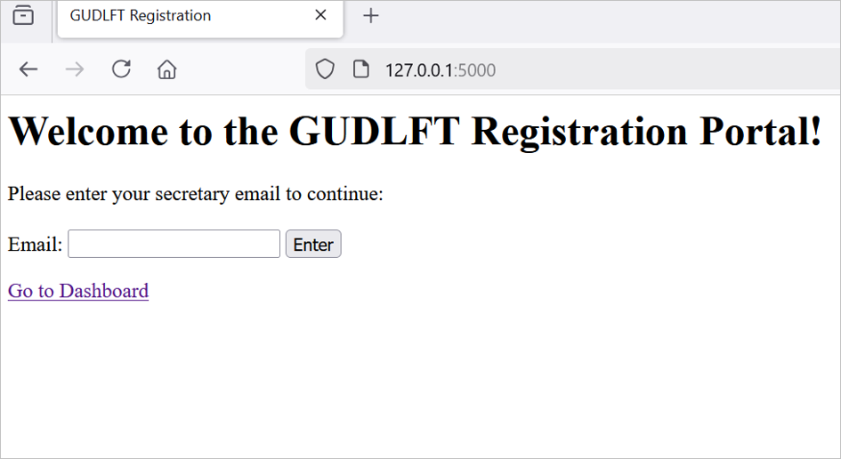
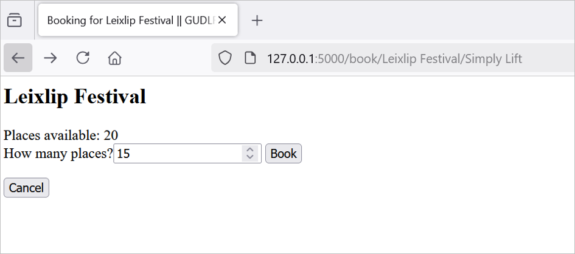

# Enhance a Python Web Application With Testing and Debugging

**OpenClassrooms - Python Developer Path:** Project 11

**Student:** Abdoul Baki Seydou

**Date:** 20/05/2024 

## Table of Contents
1. [Summary](#summary)
2. [Technologies Used](#technologies-used)
3. [Project Tasks](#project-tasks)
4. [Local Development](#local-development)
   - [Prerequisites](#prerequisites)
   - [Setup on macOS/Linux](#setup-on-macoslinux)
   - [Setup on Windows](#setup-on-windows)
   - [Running the Application](#running-the-application)
   - [Linting and Testing](#linting-and-testing)
   - [Reporting](#reporting)
   - [Screenshots](#screenshots)

## Summary
This project involves enhancing the [initial website](https://github.com/OpenClassrooms-Student-Center/Python_Testing/) 
of **Güdlft**, a company that organizes regional competitions.
The enhancements include bug fixing and adding new features.

## Features
1. **Login:** Club Secretaries can log in using their email.
2. **Viewing:** They can view all upcoming competitions.
3. **Booking:** They can use their points to book places.
4. **Booking fee:** Each place booked reduces the competition places and the club's points by 1.
5. **Booking Restrictions:** Secretaries cannot book: 
    - more than the available spots, 
    - more than they can purchase, 
    - more than 12 spots per competition, 
    - past competitions.
6. **Booking Confirmation:** Upon booking, a confirmation or error message is displayed.
7. **Logout:** They can log out of the system.

## Technologies Used
- **Programming Language:** Python  
- **Framework:** Flask  
- **Database:** Json files.

## Project Tasks
The enhancements are broken into two phases:
1. **Phase 1:** Fix the bugs in the initial code.
2. **Phase 2:** Add a Public Points Board, and additional features.

*Note:* Each bug fixed or feature added is created in a separate GitHub branch, following the naming convention:
````<feature/bug>/descriptive-name````.

## Local Development

### Prerequisites
- Python 3.6 or higher.

### Setup on macOS/Linux

1. **Clone the Repository**
   ```bash
   cd /path/to/put/project/in
   git clone https://github.com/Afudu/P11_OpenClassroom.git

2. **Move to the folder**
   ```bash
   cd P11_OpenClassroom

3. **Set Up Virtual Environment**
   ```bash
   python -m venv venv
   
4. **Activate Environment**
   ```bash
   source venv/bin/activate 

5. **Securely upgrade pip**
   ```bash
   python -m pip install --upgrade pip 

6. **Install dependencies**
   ```bash
   pip install -r requirements.txt
   
7. **To deactivate Environment**
   ```bash
   deactivate

### Setup on Windows

1. Follow the steps above.

2. To activate the environment:
   ```bash
   .\venv\Scripts\Activate

### Running the application

1. **Start the server**
  * Unix/macOS
    ```bash
    export FLASK_APP=server
    export FLASK_ENV=development
    flask run

  * Windows
    ```bash
     set FLASK_APP=server
     set FLASK_ENV=development
     flask --app server run
   
2. **Access in the browser**
   To verify the site is running, navigate to:
   ```bash
   http://127.0.0.1:5000/

### Linting and Testing
The codebase is fully linted and free of errors.

- **Run Linting**
  ```bash
  flake8

- **Run Unit Tests**
  ```bash
  pytest

- **Run Test Coverage**
  ```bash
  coverage run -m pytest
  
- **Run Performance Test**
  ```bash
  coverage run -m pytest; locust

### Reporting
- The test coverage, performance test, and PEP 8 adherence reports are located in the ```reports``` folder located in the root 
of the repository.

- The performance of the application has been tested with ```Locust```, with the rendering times adhering
to the functional requirements : less than 5 seconds to retrieve data, and less than 2 seconds to update data.

## Screenshots



